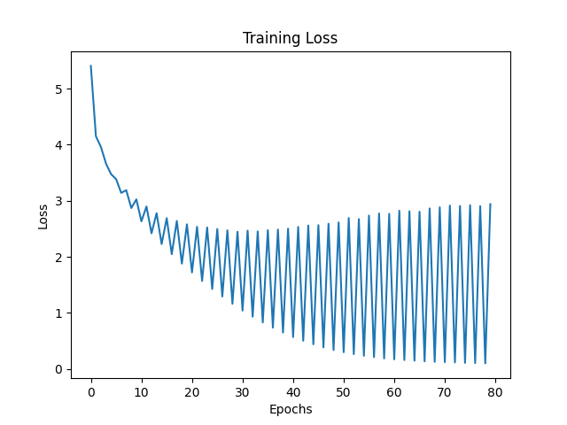
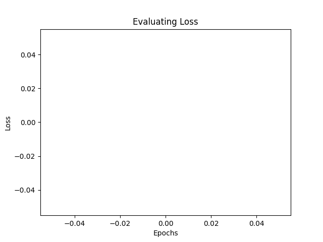
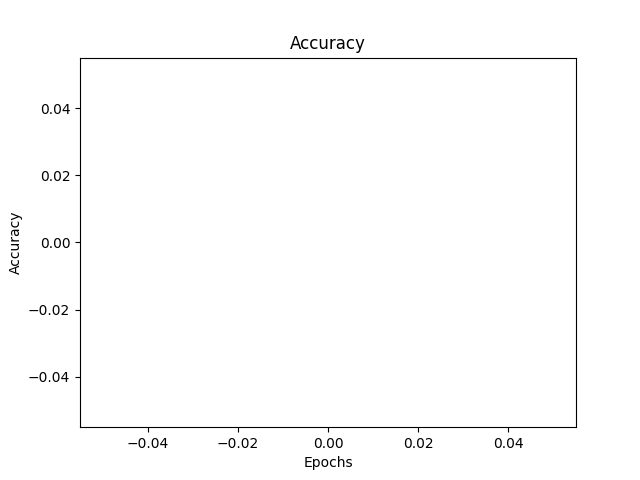

# Transformer EN→ZH from Scratch

>北京交通大学 【研】大模型基础与应用

> 一个Transformer 英→中机器翻译小项目：覆盖自注意力（Self-Attention）、编码器—解码器（Encoder–Decoder）、位置编码、遮罩、训练/评估与可视化；提供可复现实验脚本与报告模板。

- **系统**：Ubuntu 20.04
- **Python**：3.11.13
- **CUDA / PyTorch**：CUDA 12.4 · PyTorch 2.5.1
- **硬件**：单卡 RTX 4090

## 📦 依赖安装

```bash
conda create -n trans python=3.11.13 -y
conda activate trans
cd Transformer/
pip install -r requirements.txt
# 或：pip install torch==2.5.1 torchvision==0.20.1 torchaudio==2.5.1 \
#   --index-url https://download.pytorch.org/whl/cu124
# pip install matplotlib tqdm torchsummary scikit-learn numpy pandas pyyaml
```

## 📁 仓库目录结构

```bash
Transformer/
├─ configs/
│  └─ config.yaml                 # 全局配置：模型/训练/路径等
├─ data/
│  └─ en-cn/
│     ├─ cmn.txt                  # 原始双语（英文\中文）
│     ├─ english_sentences.txt    # 预处理英文
│     └─ chinese_sentences.txt    # 预处理中文
├─ results/
│  ├─ checkpoints/                # 模型权重
│  ├─ logs/                       # 训练/评估日志（Tee重定向）
│  └─ output/                     # 指标曲线、样例CSV、图表
├─ src/
│  ├─ dataset/
│  │  ├─ dataloader.py            # Dataset/Collate + padding
│  │  └─ tokenizer.py             # 分词与 Vocab 构造
│  ├─ models/
│  │  ├─ attention.py             # Dot-Product / Multi-Head
│  │  ├─ encoder.py               # EncoderLayer/Encoder
│  │  ├─ decoder.py               # DecoderLayer/Decoder
│  │  └─ model.py                 # Transformer
│  ├─ utils/
│  │  ├─ logger.py                # stdout/stderr Tee
│  │  └─ utils.py                 # 曲线绘制、模型统计、保存
│  ├─ train.py                    # 训练循环
│  └─ evaluate.py                 # 验证与导出 Top-10 样例
├─ main.py                        # 入口：配置/构建/训练/评估
├─ requirements.txt
└─ README.md
```

## 🔧 数据准备

项目使用制表符分隔的原始双语文件 data/en-cn/cmn.txt（英文 \ 中文）。预处理步骤将其拆分为两份独立语料(已完成)：

data/en-cn/english_sentences.txt

data/en-cn/chinese_sentences.txt

相应脚本命令：

```bash
python src/dataset/preprocess.py --data_path data/en-cn/cmn.txt
```

## 🚀 快速开始（训练 & 评估）

```bash
python main.py
```

### 📊 训练/验证曲线 (Loss & Accuracy)

<p align="center">
  
  <br>
  
  
</p>

### 🧪 指标对比：不同注意力头数
| Heads | Train Loss ↓ | Val Loss ↓ | Train Acc ↑ | Val Acc ↑ |
|:----:|:-------------:|:----------:|:-----------:|:---------:|
| 8    | 0.081         | 0.081      | 0.519       | 0.320     |
| 16   | **0.077**     | **0.077**  | **0.520**   | **0.325** |

### 🔧 位置编码消融
| Setting      | Train Loss ↓ | Val Loss ↓ | Train Acc ↑ | Val Acc ↑ |
|:----:|:-------------:|:----------:|:-----------:|:---------:|
| No PE | 0.082        | 0.082      | 0.517       | 0.309     |
| With PE | **0.081**    | **0.081**  | **0.519**       | **0.320**     |
### 📚 样例翻译 Top-10（EN→ZH）
<details>
<summary>点击展开查看表格</summary>

| src (EN) | trg (ZH) | pred (ZH) | acc |
|:----:|:-------------:|:----------:|:-----------:|
| "When will you come back?" "It all depends on the weather." | “ 你 什 么 时 候 回 来 ？ ” “ 这 都 要 看 天 气 。 ” | “ 你 什 么 时 候 回 来 ？ ” “ 这 都 要 看 天 氣 。 ” | 20 |
| The man you saw yesterday was my uncle. | 你 昨 天 看 到 的 那 个 男 人 是 我 叔 叔 。 | 你 昨 天 看 到 的 那 个 男 人 是 我 叔 叔 。 。 | 16 |
| "Our children like dogs, but I prefer cats." | 我 们 的 孩 子 喜 欢 狗 ， 但 我 更 喜 欢 猫 。 | 我 们 的 孩 子 喜 歡 狗 ， 但 我 更 喜 欢 猫 。 。 着 着 | 16 |
| I wish we had won the game. | 要 是 我 們 贏 了 這 場 比 賽 就 好 了 。 | 但 是 我 們 贏 了 這 場 比 賽 就 好 了 。 。 中 中 中 中 中 中 中 中 中 中 中 中 中 | 14 |
| He grew up to be an engineer. | 他 長 大 後 成 為 了 一 名 工 程 師 。 | 他 長 大 後 成 為 了 一 名 工 程 師 。 。 。 。 | 14 |
| "If you want to go, then go. If you don't want to, then it's no big deal." | 如 果 你 想 去 ， 就 去 好 了 。 如 果 你 不 想 去 ， 那 也 没 什 么 大 不 了 的 。 | 如 果 你 不 ， ， 那 沒 了 像 。 何 你 不 想 去 。 那 他 不 有 么 。 能 。 。 | 13 |
| I'll give you anything that you want. | 我 會 給 你 任 何 你 想 要 的 東 西 。 | 我 會 給 你 任 何 你 想 要 東 東 西 。 。 。 。 | 13 |
| I don't know if he can come tonight. | 我 不 知 道 他 今 晚 會 不 會 來 。 | 我 不 知 道 他 今 晚 會 不 會 來 。 。 。 。 。 。 。 。 。 | 13 |
| "The phone is ringing." "I'll get it." | “ 电 话 响 了 。 ” “ 我 去 接 。 ” | “ 电 话 响 了 。 ” “ 我 来 接 。 ” 。 地 地 地 地 地 地 | 13 |
| Tom doesn't know where Mary lives. | 汤 姆 不 知 道 玛 丽 住 在 哪 里 。 | 汤 姆 不 知 道 玛 丽 住 在 哪 里 。 。 。 。 。 。 。 。 。 | 13 |

</details>


## 🙏 致谢 Acknowledgements

本项目参考/借鉴了以下资源（排名不分先后）：

### 📘 论文与教程
- Vaswani, A., et al. *Attention Is All You Need*. 2017.  
  <https://arxiv.org/abs/1706.03762>
- Harvard NLP: *The Annotated Transformer*  
  <http://nlp.seas.harvard.edu/2018/04/03/attention.html>

### 🧩 开源实现与示例代码
- graykode/nlp-tutorial · 5-1.Transformer（从零实现 Transformer 的简洁示例）  
  <https://github.com/graykode/nlp-tutorial/tree/master/5-1.Transformer>
- open-source-toolkit/744ae（部分实现思路与注释风格参考）  
  <https://gitcode.com/open-source-toolkit/744ae>
- magarn/Foundations-and-Applications-of-LLM-ARC-transformer（相关工程结构/实践参考）  
  <https://github.com/magarn/Foundations-and-Applications-of-LLM-ARC-transformer>

### ✍️ 博客/笔记
- CSDN 文章（概念梳理与实现要点参考）  
  <https://blog.csdn.net/weixin_45956028/article/details/142673835>
- 博客园 · limingqi（Transformer 架构与实现要点整理）  
  <https://www.cnblogs.com/limingqi/p/18992275>

### 📚 官方文档
- PyTorch `nn.MultiheadAttention` / `nn.Transformer` 文档  
  <https://pytorch.org/docs/stable/nn.html#multiheadattention>  
  <https://pytorch.org/docs/stable/generated/torch.nn.Transformer.html>